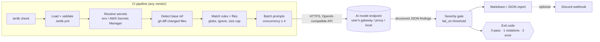
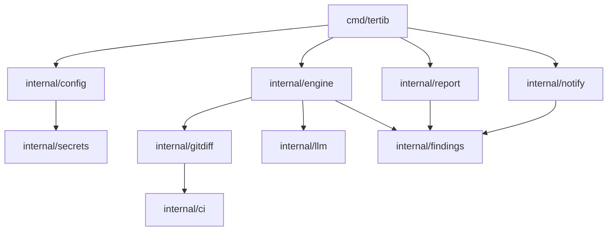
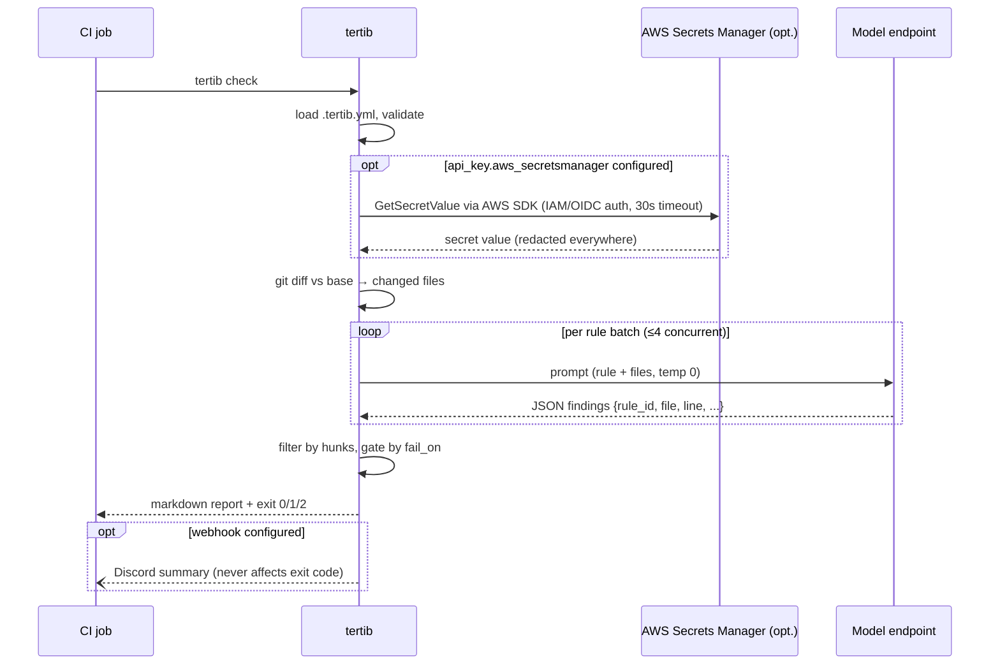

# tertib — PRD & Build Plan

## Context

Teams write down conventions (naming, file structure, layering rules, "handlers must not contain business logic") in wikis and CONTRIBUTING files, but nothing enforces them. Traditional linters (eslint, golangci-lint) only enforce what an AST rule can express; tools like ls-lint only cover file naming. Human reviewers enforce the rest inconsistently.

**tertib** (Indonesian: "fits/matches") is an open-source, vendor-neutral Go CLI that runs in any CI pipeline. Users define conventions in a YAML file as natural-language rules; tertib sends the relevant code (changed files by default) to an AI model via any **OpenAI-compatible endpoint** (user brings their own gateway/proxy/local model — no vendor lock-in) and reports violations as a markdown report + exit code that fails the pipeline.

Competitive gap (from research): [gptlint](https://github.com/gptlint/gptlint) is JS/TS-only and eslint-config-based; [Lintrule](https://www.lintrule.com/) is closed/paid; CodeRabbit etc. are hosted SaaS PR bots. Nothing is a single static Go binary, language-agnostic, YAML-configured, CI-vendor-neutral. That's tertib's niche.

## Decisions locked with user

| Decision | Choice |
|---|---|
| Scope | Diff-only by default (`git diff` vs base), `--all` for full scan |
| Engine | **Pure AI for MVP**; deterministic/hybrid engine on roadmap |
| Model access | OpenAI-compatible endpoint: `base_url` + `model` + API-key env var |
| Outputs | Markdown report + exit code (core), JSON (`--format json`), optional Discord webhook notifier |
| Languages | Language-agnostic (AI reads anything; no per-language parsers) |
| License | Open source, MIT — community files mirrored from user's `lazyssm`/`docsli` repos |
| CLI deps | stdlib `flag` only — no cobra, no viper |
| Secrets | Env var (default, vendor-neutral) + native AWS Secrets Manager provider. More providers (Vault, GCP, Azure...) later behind same interface |

## Goals / Non-goals

**Goals (MVP):** enforce YAML-defined conventions on code changes in CI; deterministic pipeline behavior (exit codes); zero vendor coupling (any CI, any OpenAI-compatible model endpoint); single static binary + Docker image.

**Non-goals (MVP):** autofix, IDE integration, SARIF, inline PR comments, hosted service, deterministic rule engine, cross-file architecture analysis. These are roadmap items.

## Product requirements

### CLI surface (stdlib `flag`, subcommand switch — same style as lazyssm/docsli; no cobra, no viper — user-confirmed)

```
tertib init                      # scaffold .tertib.yml with commented example
tertib validate                  # validate config, exit 2 on bad schema
tertib check [flags]             # main command
    --all                       # full repo scan instead of diff
    --base <ref>                # diff base (default: auto-detect from CI env, fallback origin/main)
    --config <path>             # default .tertib.yml
    --format markdown|json      # default markdown
    --output <file>             # default stdout
    --fail-on error|warning|never   # overrides config
tertib version
```

**Exit codes:** `0` = pass, `1` = violations at/above fail-on threshold, `2` = config/runtime error. CI distinguishes "convention broken" from "tool broke".

### Config schema (`.tertib.yml`)

```yaml
version: 1

model:
  base_url: https://your-gateway.example.com/v1   # any OpenAI-compatible endpoint
  name: your-model-name
  api_key:
    env: TERTIB_API_KEY              # source 1: env var (default/simplest)
    # aws_secretsmanager:           # source 2: AWS Secrets Manager
    #   secret_id: tertib/api-key    #   name or ARN
    #   json_key: api_key           #   optional: pick field if secret value is JSON
    #   region: ap-southeast-1      #   optional: falls back to SDK default chain
  temperature: 0
  timeout: 60s
  max_retries: 3

checks:
  fail_on: error                    # error | warning | never
  ignore: ["vendor/**", "**/*.gen.go", "dist/**"]
  max_file_kb: 200                  # skip huge files, warn in report

rules:
  - id: handler-naming
    severity: error
    paths: ["internal/handlers/**"]      # glob scoping; omit = all files
    description: |
      Handler files use snake_case. Handler funcs named <Verb><Resource>Handler.
  - id: no-business-logic-in-handlers
    severity: warning
    paths: ["internal/handlers/**"]
    description: |
      Handlers only parse input, call a service, write response. No business logic.

output:
  notify:
    discord_webhook:                # optional; same secret-source block
      env: TERTIB_DISCORD_WEBHOOK
```

### Secret resolution (vendor-neutral)

Any secret-valued field (`model.api_key`, `output.notify.discord_webhook`, future ones) is a **secret source block** accepting exactly one of:

- `env: NAME` — read env var. CI-native default; keeps tertib vendor-neutral since every CI/secret-store can inject env vars.
- `aws_secretsmanager: {secret_id, json_key?, region?}` — fetch via AWS SDK (`aws-sdk-go-v2/service/secretsmanager`, same SDK family already used in lazyssm). Auth via standard AWS credential chain (env keys, IAM role, OIDC web identity) — no credentials in tertib config. `json_key` extracts a field when the secret value is a JSON object.

Provider design: small `secrets.Source` interface so Vault/GCP/Azure/1Password providers slot in later without config-schema breakage. Guardrails: resolution wrapped in context timeout (default 30s); resolved values never logged and scrubbed from error messages/report output; empty value = hard error (exit 2).

### AI evaluation

- For each rule, gather matching changed files (respect `ignore`, `paths`, `max_file_kb`), batch into prompts.
- Prompt asks for **structured JSON findings**: `{rule_id, file, line, snippet, explanation, suggestion, confidence}` — use `response_format: json_schema` when endpoint supports it, tolerant JSON extraction fallback.
- Temperature 0, bounded retries with backoff, per-file concurrency limit (default 4).
- Report includes token usage/rough stats per run (gptlint does this; users need cost visibility).
- Treat repo content strictly as data in prompts (prompt-injection hardening note in system prompt).

### Diff detection & CI neutrality

- `internal/gitdiff`: changed files + hunks via `git diff --merge-base <base>...HEAD` (needs fetch-depth guidance in docs).
- Base auto-detect from env: `GITHUB_BASE_REF`, `CI_MERGE_REQUEST_TARGET_BRANCH_NAME` (GitLab), `BITBUCKET_PR_DESTINATION_BRANCH`, generic fallback `origin/main`; `--base` always wins.
- Findings outside changed hunks are demoted to "context notes" in diff mode (low noise — reviewdog's key lesson).
- Distribution: single binary (goreleaser: darwin/linux/windows, arm64/amd64) + Docker image → works in any CI with 2 lines.

### Reporting

- **Markdown**: summary table (rule, severity, count) + per-finding sections with file:line, snippet, explanation, suggestion. Renders in GitHub Step Summary / GitLab MR / anywhere.
- **JSON**: full findings array + run metadata (model, tokens, duration).
- **Discord**: optional webhook POST with compact summary + pass/fail, fired after report generation; failure to notify never changes exit code.

## Architecture

### System flow — one `tertib check` run in CI



### Component dependencies



### Rule evaluation sequence



### Package layout

```
cmd/tertib/main.go          # flag parsing, subcommand dispatch
internal/config/           # YAML load, schema validation, defaults
internal/gitdiff/          # changed files/hunks, base ref detection
internal/ci/               # CI env detection (base ref, is-CI)
internal/engine/           # orchestration: rule×file matching, batching, concurrency
internal/llm/              # OpenAI-compatible client (net/http, no SDK), retries, JSON extraction
internal/secrets/          # secrets.Source interface: env provider, AWS SM provider (aws-sdk-go-v2), redaction registry
internal/findings/         # finding types, severity filtering, hunk demotion
internal/report/           # markdown + json renderers
internal/notify/           # discord webhook
```

Module `github.com/chalvinwz/tertib`, Go 1.26, minimal deps (`gopkg.in/yaml.v3`, `aws-sdk-go-v2` config+secretsmanager only, stdlib elsewhere) — matches lazyssm/docsli style.

## Repo scaffolding (copy patterns from lazyssm/docsli)

MIT `LICENSE`, `README.md`, `CONTRIBUTING.md`, `SECURITY.md`, `CHANGELOG.md`, `Makefile`, `.golangci.yml`, `.goreleaser.yaml`, `Dockerfile`, `.editorconfig`, `.gitignore`, `.github/` (CODEOWNERS, dependabot.yml, pull_request_template.md, ISSUE_TEMPLATE/, workflows/ci.yml, workflows/release.yml). Reference: `~/workspace/lazyssm` and `~/workspace/docsli`.

## Working agreement

**No git commits or pushes at any point unless the user explicitly asks.** Applies to all milestones including scaffold and release steps.

## Milestones

1. **M1 — Skeleton**: repo scaffold + community files; CLI dispatch; `init`/`validate`; config package; secrets resolver (env + AWS SM); gitdiff + CI base detection. Testable without any AI.
2. **M2 — AI engine**: llm client, engine orchestration, structured findings, retries/limits.
3. **M3 — Reports & gates**: markdown/JSON renderers, severity gating, exit codes, hunk demotion.
4. **M4 — Ship**: Discord notifier, Dockerfile, goreleaser release, README with GitHub Actions/GitLab CI copy-paste examples, dogfood on tertib itself.

## Verification

- Unit tests per package; golden-file tests for markdown/JSON reports.
- `internal/llm` e2e via `httptest` mock OpenAI-compatible server (canned JSON responses, malformed-JSON cases, 429 retry).
- gitdiff tests against throwaway git repos created in `t.TempDir()`.
- secrets tests: env source, AWS SM source via mocked `secretsmanager` client interface (plain string secret, `json_key` extraction, missing secret error), timeout, empty-value error, redaction of resolved value in rendered errors/reports.
- End-to-end: run `tertib check` on this repo with a sample `.tertib.yml` against a mock server; then real run against user's actual model endpoint.

## Risks

- **False positives/nondeterminism**: temp 0, confidence field, `fail_on` control, per-rule severity; hybrid engine later kills the worst class.
- **Cost/latency**: diff-only default, ignore globs, file-size cap, batching, token stats in report.
- **Code sent to model endpoint**: user controls endpoint (can be self-hosted); document clearly in README/SECURITY.
- **Prompt injection via repo content**: system prompt hardening, findings limited to structured schema.
- **Secret exposure**: resolved secrets kept in memory only, registered for redaction in all logs/errors/reports; AWS auth delegated entirely to SDK credential chain (no keys in tertib config).

## Roadmap (post-MVP)

Hybrid deterministic engine (regex naming/structure rules run free & instant) → SARIF output → GitHub Action wrapper + PR inline comments (or via reviewdog) → response caching keyed on content hash → baseline file for legacy-code adoption → more secret-store providers behind `secrets.Source` interface (HashiCorp Vault, GCP Secret Manager, Azure Key Vault, 1Password).

## Research sources

- [gptlint](https://github.com/gptlint/gptlint) — closest OSS competitor (JS/TS-only)
- [Lintrule](https://www.lintrule.com/) — closed-source LLM code review CLI
- [reviewdog](https://github.com/reviewdog/reviewdog) — diff-scoped reporting lesson, future SARIF bridge
- [ls-lint](https://github.com/loeffel-io/ls-lint) — YAML naming/structure linter (deterministic-engine inspiration)
- [CodeRabbit universal linter post](https://www.coderabbit.ai/blog/ai-native-universal-linter-ast-grep-llm), [Cloudflare AI review at scale](https://blog.cloudflare.com/ai-code-review/), [LintCFG paper](https://arxiv.org/abs/2602.07783)